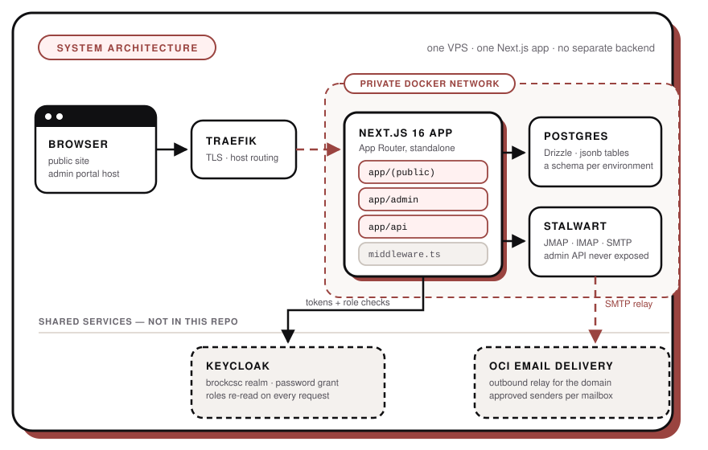
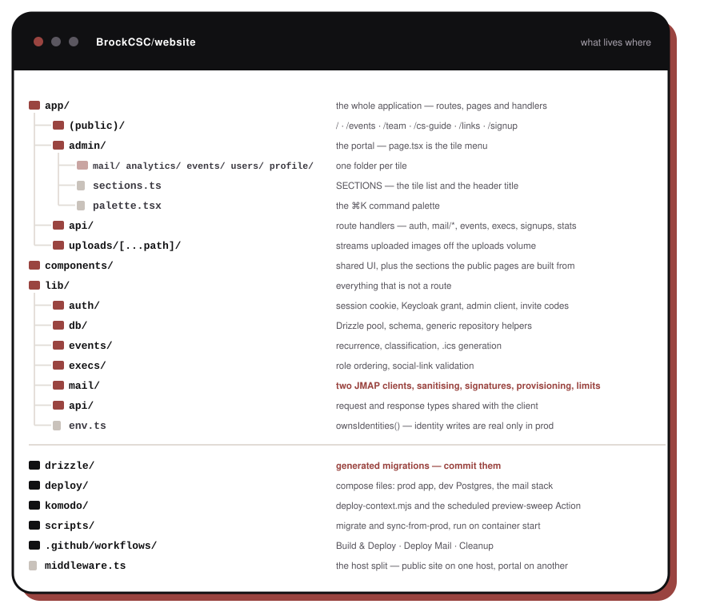
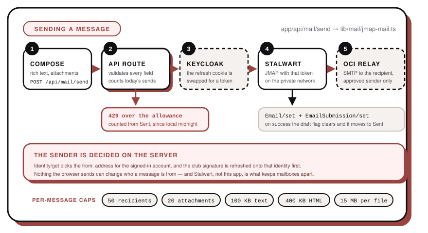
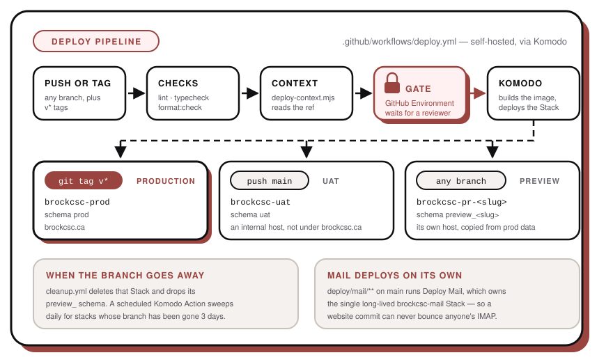

# Contributing

Everything technical lives here. The [README](README.md) is user-facing only.

## Prerequisites

- **Node 22.9+** — the dev scripts use `node --env-file-if-exists`
- **Docker** — for the local Postgres only
- A Keycloak account in the `brockcsc` realm, if you need the admin portal

## Running locally

```bash
git clone git@github.com:BrockCSC/website.git && cd website
npm ci
npm run db:up                       # local Postgres 16 on :5432
cp .env.local.example .env.local    # then fill in KEYCLOAK_CLIENT_SECRET
npm run dev                         # migrates first, then http://localhost:3000
```

Prod Postgres is not reachable from your machine, so local dev runs a throwaway Postgres in Docker.
Keycloak is public, so you log in against the real realm — there is no local Keycloak.

| Script                            | What it does                                                   |
| --------------------------------- | -------------------------------------------------------------- |
| `npm run dev`                     | `predev` runs `scripts/migrate.mjs`, then `next dev --webpack` |
| `npm run build`                   | `next build` (standalone output, see `Dockerfile`)             |
| `npm run start`                   | `next start`                                                   |
| `npm run lint`                    | `eslint`                                                       |
| `npm run typecheck`               | `next typegen && tsc --noEmit`                                 |
| `npm run format` / `format:check` | Prettier write / verify — CI runs the check                    |
| `npm run deadcode`                | `knip` — unreached files, exports and deps; not run by CI      |
| `npm run db:generate`             | `drizzle-kit generate` — writes a migration into `drizzle/`    |
| `npm run db:migrate`              | Applies migrations to `DB_SCHEMA`                              |
| `npm run db:up` / `db:down`       | Starts / stops `deploy/docker-compose.dev.yml`                 |

`scripts/migrate.mjs` refuses to start without `DATABASE_URL`, creates `DB_SCHEMA` if missing, and
rejects schema names that are not `^[a-z0-9_]+$`.

Local dev uses the `local` schema, separate from `prod`, `uat` and previews. A fresh one is
**empty**, and `scripts/sync-from-prod.mjs` no-ops without a `prod` schema in the same database, so
add events and execs by hand through the portal. `npm run db:down` stops the container; a named
Docker volume keeps the data.

> **Use Chrome or Firefox locally.** `sessionCookieOptions` sets `secure: true` unconditionally.
> Chrome and Firefox will set a `Secure` cookie on `http://localhost`; Safari will not, so the
> session never sticks.

## Getting into the admin portal

Auth is a direct password grant against the shared Keycloak `brockcsc` realm (`KEYCLOAK_ISSUER`).
Two separate asks:

1. **`KEYCLOAK_CLIENT_SECRET`** for the `brockcsc-web` client, from a club admin or the Komodo stack
   config. Never commit it — `.env.local` is gitignored, keep it that way.
2. **A realm role on your user.** Without one, `POST /api/auth/login` returns 403 and you get no
   session cookie at all. This catches people out.

| To test                                  | You need                                                          |
| ---------------------------------------- | ----------------------------------------------------------------- |
| Own profile only                         | `alumni`                                                          |
| Portal, mail, analytics, events, profile | `executive`                                                       |
| Approving sign-ups, roles, mail limits   | `co-president` (composite, carries `brockcsc-approver`)           |
| Sign-up creating accounts                | `KEYCLOAK_ADMIN_CLIENT_ID` / `_SECRET` for `brockcsc-provisioner` |
| Everything, permanently                  | `owner` (see below)                                               |

`owner` (`SUPERUSER_ROLE`) passes every role check, including gates added later, because the check
lives in `requireRole` in `lib/auth/session.ts`. It is a realm role, so Keycloak can revoke it like
any other. Grant it sparingly.

Roles come from Keycloak **on each request** (15-second cache), not from the session cookie, so
grants and revokes apply at once. If Keycloak is unreachable, admin requests are denied rather than
falling back to stale roles. The SSE channel `GET /api/auth/roles-stream` (`lib/auth/role-events.ts`)
pushes an empty `roles` event, so an open tab re-reads `/api/auth/me` without a reload; losing every
role swaps the portal to "Your access has been removed."

The `brockcsc-provisioner` service account holds `manage-users` and `view-realm`, and deliberately
**not** `manage-realm`: it runs at request time, so a leaked secret must not be able to rewrite the
realm's role model. Roles are created by hand instead.

Sign-up creates the Keycloak user **disabled**, so it cannot log in until approved; rejecting deletes
it. Both are real writes against the shared realm — use fake names and clean up.

Outside production, identity changes are **rehearsed, not written**: `ownsIdentities()` in
`lib/env.ts` is true only when `DB_SCHEMA === "prod"`, and the users screen says so. Results report
`applied / rehearsed / skipped / failed`.

## Architecture

One Next.js 16 App Router app, no separate backend. It runs as a container on one VPS behind Traefik,
deployed by Komodo.



### What lives where



**Host split.** `middleware.ts` gives the portal its own hostname. With `ADMIN_SUBDOMAIN` set, that
host rewrites `/` to `/admin` and 308s public paths to `PUBLIC_SUBDOMAIN`; the public host 308s
`/admin*` back the other way. With neither set (local dev) both live on `localhost:3000`.

**Data model.** Four tables of one shape — `id uuid`, `data jsonb`, `created_at` — from
`jsonbTable()` in `lib/db/schema.ts`: `events`, `execs`, `signups`, `page_views`.
`createCollectionHandlers` / `createItemHandlers` in `lib/db/repository.ts` generate the CRUD routes,
so a new collection is a schema entry plus a route file, not a new query layer.

**Theming.** Light by default. Dark is the `dark` class on `<html>` plus `localStorage`
`brockcsc-theme`, applied by an inline script in `app/layout.tsx` before paint to avoid a flash.
Tailwind v4, `@custom-variant dark (&:is(.dark *))` in `app/globals.css`. Brand `#9a4440`, dark
accent `#e08a82`. No system-preference option, no theme context: `components/theme-toggle.tsx` and
the palette action flip the class directly.

**Analytics data.** `components/page-view-tracker.tsx` POSTs the pathname to `/api/page-view` on
every public navigation. That route rate-limits to 60/min per IP, rejects non-public paths, `/admin`
and anything over 200 characters, and stores **only path and timestamp** — no cookies, IP, user agent
or sessions. So the numbers are raw views, not unique visitors, bucketed in `America/Toronto`, not
the server's timezone.

## Environment variables

Documented in `.env.example` (production shape) and `.env.local.example` (the local subset).

| Variable                               | Required    | Default                        | Notes                                                                                        |
| -------------------------------------- | ----------- | ------------------------------ | -------------------------------------------------------------------------------------------- |
| `DATABASE_URL`                         | yes         | —                              | Postgres connection string                                                                   |
| `DB_SCHEMA`                            | no          | `public`                       | Schema per environment. Must match `^[a-z0-9_]+$`. Only `prod` makes identity changes real   |
| `KEYCLOAK_ISSUER`                      | yes         | —                              | Realm issuer URL                                                                             |
| `KEYCLOAK_CLIENT_ID`                   | yes         | `brockcsc-web` in examples     | Login client                                                                                 |
| `KEYCLOAK_CLIENT_SECRET`               | yes         | —                              | **Secret.** The one value you cannot make up locally                                         |
| `ADMIN_ROLE`                           | no          | `executive`                    | Realm role required to reach the portal                                                      |
| `ALUMNI_ROLE`                          | no          | `alumni`                       | Past execs: own profile only                                                                 |
| `APPROVER_ROLE`                        | no          | `brockcsc-approver`            | Bundled into the `co-president` composite role                                               |
| `SUPERUSER_ROLE`                       | no          | `owner`                        | Passes every role check                                                                      |
| `KEYCLOAK_ADMIN_CLIENT_ID` / `_SECRET` | for sign-up | falls back to the login client | **Secret.** Service account with `manage-users` + `view-realm`                               |
| `SESSION_JWT_SECRET`                   | yes         | —                              | **Secret.** Signs our own session cookie, not the Keycloak token                             |
| `INVITE_CODE_SECRET`                   | yes         | —                              | **Secret.** Seeds the rotating sign-up invite code; changing it invalidates codes handed out |
| `MAIL_DOMAIN`                          | no          | `brockcsc.ca`                  | Mailbox domain                                                                               |
| `STALWART_URL`                         | for mail    | —                              | Stalwart on the internal Docker network; its admin API is never exposed publicly             |
| `STALWART_ADMIN_USER` / `_SECRET`      | for mail    | —                              | **Secret.** Basic auth for the provisioning client only                                      |
| `OCI_COMPARTMENT_OCID`                 | for mail    | —                              | **Secret.** OCI Email Delivery approved senders, via instance principal auth (no keys)       |
| `PROTECTED_MAIL_USERS`                 | no          | `alaqmargandhi`                | Comma-separated accounts that can never be deprovisioned or rate-limited                     |
| `MAIL_DAILY_LIMIT`                     | no          | `50`                           | Outbound messages per user per day (ceiling 500)                                             |
| `MAIL_SITE_URL`                        | no          | `https://brockcsc.ca`          | Link target in the mail signature                                                            |
| `ADMIN_MAIL_GROUP`                     | no          | `admin`                        | Stalwart group kept in sync with the current execs                                           |
| `ADMIN_SUBDOMAIN` / `PUBLIC_SUBDOMAIN` | prod only   | unset                          | Enables the middleware host split                                                            |
| `UPLOAD_DIR`                           | prod only   | —                              | `/data/uploads` in the container, on the `brockcsc-uploads` volume                           |
| `PORT`                                 | no          | `3000`                         | Set by the Dockerfile                                                                        |

`MAIL_DAILY_LIMIT`, `MAIL_SITE_URL` and `ADMIN_MAIL_GROUP` are read by the code
but are not in `.env.example` — they run on their defaults. Add them there to override one.

## Database and migrations

Edit `lib/db/schema.ts`, then:

```bash
npm run db:generate      # writes drizzle/NNNN_*.sql — commit it
```

Every environment is a schema in one shared database (`DB_SCHEMA`). Migrations run per-schema on
container start: the `Dockerfile` `CMD` runs `migrate.mjs`, then `sync-from-prod.mjs`, then the
server. Never hand-edit a migration that has already shipped.

`sync-from-prod.mjs` truncates `events`, `execs` and `signups` in the current schema and re-copies
them from `prod` on every deploy, unless `DB_SCHEMA` is `prod` or no `prod` schema exists. So preview
and uat data is temporary — and what you write to prod is not.

## Mail



Two JMAP clients, for two jobs.

**As the signed-in user** — `lib/mail/jmap-mail.ts`, behind everything under `app/api/mail/`. The
Keycloak refresh token in the `brockcsc_refresh` httpOnly cookie is swapped per request for a
short-lived access token (`lib/auth/mail-token.ts`), used as the JMAP `Bearer`. The app never reads
someone else's mailbox — Stalwart enforces that, not us. Sessions lapse after 30 minutes idle, so the
portal POSTs `/api/mail/keepalive` every 10 minutes while the tab is visible.

**As an administrator** — `lib/mail/stalwart.ts`, Basic auth with `STALWART_ADMIN_USER/SECRET` and
Stalwart's `urn:stalwart:jmap` extension. Only for provisioning accounts, group membership, and
making a past exec's mailbox read-only.

Bodies are sanitised server-side (`lib/mail/sanitize.ts`, `isomorphic-dompurify`) and rendered in an
`<iframe sandbox="" srcDoc>` with its own CSP and `referrer-policy: no-referrer`. Attachments go
through `/api/mail/blob/[blobId]`, which forces `Content-Disposition: attachment`, rewrites
`html|xml|svg|javascript` MIME types to `application/octet-stream`, and sets
`default-src 'none'; sandbox`. Keep it that way.

Send limits (`lib/mail/limit.ts`) count the Sent mailbox since local midnight via
`Email/query … calculateTotal`, so mail sent from any other client counts too; over the limit,
`POST /api/mail/send` returns **429**. Caps per message: 100 KB text, 400 KB HTML, 20 attachments,
50 recipients, 15 MB per uploaded file.

**TLS.** Stalwart serves its own self-signed certificate unless given one, which mail apps either
refuse outright or warn about. Traefik already holds a Let's Encrypt wildcard for `*.brockcsc.ca`
(Cloudflare DNS-01, stored under `le-dns` in `acme-dns.json`), so `deploy/mail/refresh-cert.sh` copies
it into Stalwart through `x:Certificate/set` and restarts the container when the expiry changes. It is
idempotent, so run it as often as you like. Install it on the VPS beside `drop-db.sh` and give it a
daily timer - nothing runs it automatically from this repo, and the certificate goes stale roughly
every sixty days without it.

**Outside mail apps.** Keycloak passwords do not authenticate against Stalwart, so IMAP and SMTP need
a Stalwart app password. `/admin/mail/setup` lets a member mint one per device and revoke it, through
`x:AppPassword/set` in `lib/mail/stalwart.ts`; the secret is returned once and never readable again.
`makeMailboxReadOnly` revokes every one of them, so a stepped-down exec's mail app stops when their
portal access does. IMAP is `mail.brockcsc.ca:993` and submission `:465`, both SSL, username being the
full address — the same values Stalwart publishes at `autoconfig.brockcsc.ca`.

The mail stack (`deploy/mail/docker-compose.yml`) has its own workflow, so website commits never
bounce IMAP.

## Deploys

Self-hosted, orchestrated by [Komodo](https://komo.do) through the reusable actions in
[`BrockCSC/komodo-deploy`](https://github.com/BrockCSC/komodo-deploy).

**The VPS does not build anything.** GitHub Actions builds the image and pushes it to
`ghcr.io/brockcsc/brockcsc-ca:<commit-sha>`; the VPS pulls that tag and runs it. Actions minutes are
free and unlimited on a public repo, VPS cores are not — and a preview deploy no longer competes with
production for them.



| Workflow                                              | Trigger                                             | What it does                                                                                           |
| ----------------------------------------------------- | --------------------------------------------------- | ------------------------------------------------------------------------------------------------------ |
| `.github/workflows/ci.yml` — **CI**                   | every pull request, push to `main`, tags `v*`       | lint + typecheck + `format:check`, `npm audit`, dependency review — the merge gate                     |
| `.github/workflows/deploy.yml` — **Build & Deploy**   | push to any branch, tags `v*`                       | builds and pushes the image, scans it with Trivy, syncs secrets into Komodo Variables, deploys a Stack |
| `.github/workflows/deploy-mail.yml` — **Deploy Mail** | push to `main` touching `deploy/mail/**`, or manual | deploys the single long-lived `brockcsc-mail` Stack                                                    |
| `.github/workflows/cleanup.yml` — **Cleanup**         | branch deleted                                      | deletes that branch's Komodo Stack and drops its `preview_*` schema                                    |

The image scan does not gate the deploy: a CVE published against the base image overnight should
shout, not stand between you and a hotfix. Findings land in the repository's Security tab.

`komodo/deploy-context.mjs` reads `GITHUB_REF` and prints the Stack's whole `KEY=VALUE` environment
block. Secrets are never in it — they are `[[BROCKCSC_NAME]]` placeholders Komodo resolves from its
own Variables.

| Ref              | Stack                | Schema           | Where                       |
| ---------------- | -------------------- | ---------------- | --------------------------- |
| a tag            | `brockcsc-prod`      | `prod`           | brockcsc.ca                 |
| `main`           | `brockcsc-uat`       | `uat`            | an internal host            |
| any other branch | `brockcsc-pr-<slug>` | `preview_<slug>` | an internal per-branch host |

Preview and uat sit off `brockcsc.ca` on purpose: their databases are copies of prod, so they should
not be discoverable. `komodo/actions/preview-sweep.ts` — a Komodo Action registered by the
`ensure-action` step and run daily at 09:00 — tears down preview stacks and schemas whose branch has
been gone three days, catching whatever `cleanup.yml` missed.

## Adding an environment variable

Add it in **all four** places or deploys break:

1. `.env.example`
2. `.env.local.example` — if it is needed locally
3. `deploy/docker-compose.yml`
4. `komodo/deploy-context.mjs` — secrets as `[[BROCKCSC_NAME]]` placeholders

A secret also needs a GitHub secret, a `sync_var` line in `deploy.yml`, and the Komodo Variable.

## Conventions and checks

- Comments only where they earn their place. Prefer the smaller change — more code is more to break.
- Arrow-function exports, `type` over `interface`, named exports.
- Gate every admin route with `requireAdmin` / `requireApprover` from `lib/auth/session.ts`.
- Never trust a client-side gate. `hidden` on a profile, role checks and limits are all enforced
  server-side too.

Before opening a PR:

```bash
npm run lint && npm run typecheck && npm run format:check && npm run build
```

CI runs the first three plus a dependency review, and `main` will not take a pull request until they
pass — along with CodeQL, which runs from the repository's code scanning default setup rather than
from a workflow here. `npm audit` runs too but does not block: an advisory in a transitive dependency is
not the fault of whichever PR is open when it lands.

## Opening a pull request

Push a branch — it gets its own preview environment and `preview_<slug>` schema automatically, and
the environment URL appears on the workflow run. Fill in `.github/pull_request_template.md`,
including how a reviewer can test it and whether it needs a role or env var that does not exist yet.

Deleting the branch tears the preview down. Merging to `main` deploys to uat; tagging deploys to
production.
