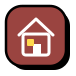
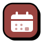
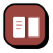
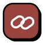
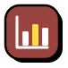
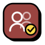
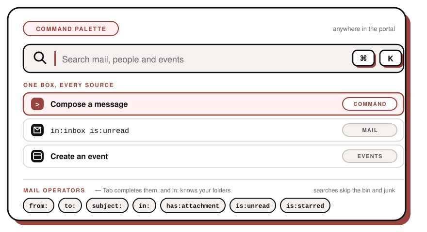
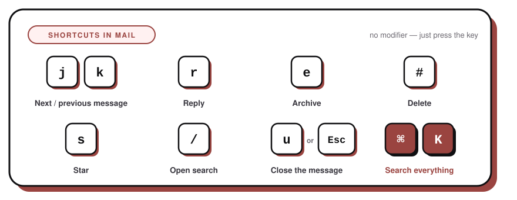
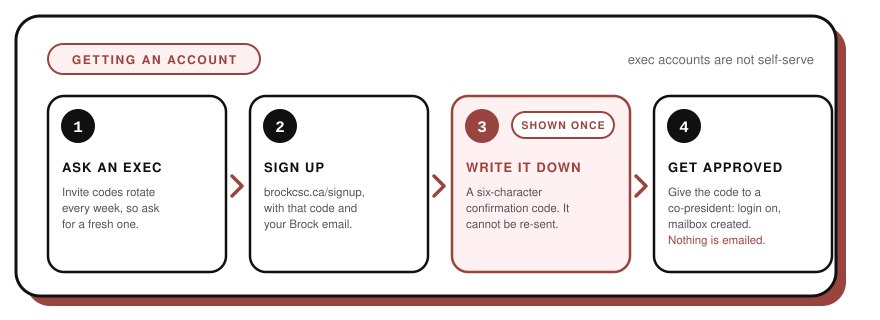

<picture>
  <source media="(prefers-color-scheme: dark)" srcset="public/logo-light.svg" />
  
</picture>

 
 

 

**The home of the Brock University Computer Science Club on the web.**
A community of 900+ students who code, connect, and create together.

 

 

## For everyone

The public side of **[brockcsc.ca](https://brockcsc.ca)**. No account needed.

<table width="100%">
  <tr>
    <td width="88" align="center" valign="middle"></td>
    <td valign="middle">
      <strong>Home</strong> 
      The landing page. A hero, what the club is about, and whatever's coming up next.
    </td>
  </tr>
  <tr>
    <td align="center" valign="middle"></td>
    <td valign="middle">
      <strong>Events</strong> 
      One-off events and recurring ones — weekly, biweekly or monthly. Everything is worked out
      against Toronto time and split into what's happening <em>now</em>, what's coming up, and what
      already happened. Search by title, presenter or location. Every event has its own page with a
      poster, a registration link, an <strong>Add to calendar</strong> button that downloads an
      <code>.ics</code>, and a copy-link button.
    </td>
  </tr>
  <tr>
    <td align="center" valign="middle"></td>
    <td valign="middle">
      <strong>Team</strong> 
      The current execs, sorted by role, each with a photo, a short bio and their socials. Past execs
      get their own wall, grouped by the term they served.
    </td>
  </tr>
  <tr>
    <td align="center" valign="middle"></td>
    <td valign="middle">
      <strong>CS Guide</strong> 
      Written by students, for students. How to read a course code, what the credit types mean,
      program requirements, and where to go for help.
    </td>
  </tr>
  <tr>
    <td align="center" valign="middle"></td>
    <td valign="middle">
      <strong>Links</strong> 
      Discord, ExperienceBU, Instagram, GitHub and LinkedIn, all on one page.
    </td>
  </tr>
</table>

 

## For the exec team

Sign in and you land on a **tile menu** — one card per thing you can do, and only the ones you're
allowed to. Everything else is one hop away from there.

<table width="100%">
  <tr>
    <td width="88" align="center" valign="middle"></td>
    <td valign="middle">
      <strong>Email</strong> 
      A full webmail client for your <code>@brockcsc.ca</code> mailbox — no separate app, no IMAP
      setup. Folders with unread counts, conversation threading, rich-text compose with attachments,
      reply / reply-all / forward with the original quoted properly, star, archive, move and delete.
      Your club signature is added for you. The bin empties itself after a week, and you can delete
      for good from inside it.
    </td>
  </tr>
  <tr>
    <td align="center" valign="middle"></td>
    <td valign="middle">
      <strong>Analytics</strong> 
      Page views over the last 30 days with a trend line and the most visited pages, mail sent versus
      received, sign-ups waiting on you, upcoming events, and a health check on the team page —
      who's missing a photo or a bio. Only path and time are ever recorded: no cookies, no IPs, no
      tracking of individual people.
    </td>
  </tr>
  <tr>
    <td align="center" valign="middle"></td>
    <td valign="middle">
      <strong>Events</strong> 
      Publish and edit what the club is running, split into Upcoming, Recurring and Past. Add a
      poster, a location, a start and end time, a repeat rule and a sign-up link. It's live on the
      public site the moment you save.
    </td>
  </tr>
  <tr>
    <td align="center" valign="middle"></td>
    <td valign="middle">
      <strong>Users</strong> (co-presidents) 
      Approve sign-ups, grant and revoke roles, provision mailboxes, edit anyone's public tile, and
      move people between the current team and the alumni wall. Every action tells you exactly what
      it will do <em>before</em> you confirm it, with a checklist you can untick line by line.
    </td>
  </tr>
  <tr>
    <td align="center" valign="middle"></td>
    <td valign="middle">
      <strong>Profile</strong> 
      Your own tile on the team page — photo (with a focal-point picker so you're never cropped
      badly), bio, term and socials, previewed live as you type. There's a toggle to hide yourself
      from the team page entirely.
    </td>
  </tr>
</table>

 

### Search everything with <kbd>⌘</kbd> <kbd>K</kbd>

Press <kbd>⌘K</kbd> (or <kbd>Ctrl</kbd> <kbd>K</kbd>) anywhere in the portal. One box searches your
mail, people and events at once, and doubles as a command bar — compose a message, create an event,
jump to pending sign-ups, toggle dark mode, log out. Your last few picks are remembered.

Mail search understands those operators and <kbd>Tab</kbd> completes them for you. `in:` suggests
your actual folders, and searches skip the bin and junk unless you ask for them.

### Keyboard shortcuts in mail

### Sending limits

Outbound club mail is metered, so everyone has a daily send allowance shown in the mail sidebar.
When you're running low a **Request more** button appears — say how many you need and why, and a
co-president approves it. The count resets at midnight.

 

## Getting an account

Exec accounts aren't self-serve. You'll need an **invite code** from a current exec — it rotates
every week, so ask for a fresh one.

1. Go to **[brockcsc.ca/signup](https://brockcsc.ca/signup)** and fill in the form with your invite
   code and your Brock email. Former execs can tick the box to say so.
2. You'll be shown your username, your new `@brockcsc.ca` address, and a **six-character
   confirmation code**. Write it down — it is shown once and cannot be sent to you again.
3. Give that code to a co-president so they can confirm the request really came from you.
4. Once they approve, your login is enabled and your mailbox is created. Nothing is emailed to you
   on approval, so check with them.

Then sign in at **[brockcsc.ca/admin](https://brockcsc.ca/admin)** with the username and password
you chose.

 

## The look

Neubrutalist throughout: flat colours, thick black outlines, and hard shadows offset in brand red
(`#9A4440`). No gradients, no blur. Buttons press down when you click them, cards lift on hover,
and the member badge bobs.

There's a **dark theme** too — the sun/moon button in the navbar, or "Toggle dark mode" in ⌘K. It
sticks between visits, uses a warmer accent (`#e08a82`), and even the emails you read follow it.

 

## Contributing

Architecture, local setup, environment variables, the deploy pipeline and conventions all live in
**[CONTRIBUTING.md](CONTRIBUTING.md)**. Issues and pull requests are welcome from anyone at Brock.

Licensed under the [MIT Licence](LICENSE).

 

## Come say hi

 

Built by students, for students · Self-hosted and deployed with Komodo

