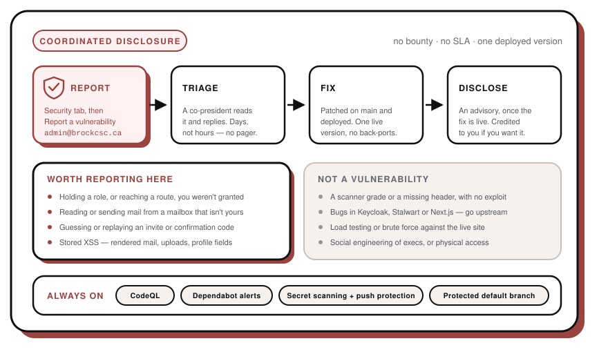

# Security policy

This repo runs **[brockcsc.ca](https://brockcsc.ca)** and the exec portal behind it — sign-in,
club mailboxes, and the personal details of everyone who has ever signed up. We would much rather
hear about a problem from you than find out the hard way.

## Reporting

Use **[Report a vulnerability](https://github.com/BrockCSC/website/security/advisories/new)** on the
Security tab. Private reporting is enabled, so the thread stays between us until there is a fix. If
GitHub isn't an option, email **admin@brockcsc.ca**, which reaches the co-presidents and the repo
owner.

Tell us what you did, what happened, and what you think someone could get with it. A short proof of
concept is worth more to us than a scanner report.

## What happens next

We're students, volunteering. There's no rota, no pager and no SLA. Someone will read your report
and answer you — days rather than hours, and slower over exams and the summer. There is **no bug
bounty**: what we can offer is credit in the advisory, under whatever name you like, and our
genuine thanks.

## Supported versions

There is one deployed version, at `brockcsc.ca`, and it's the one that gets fixed. Nothing is
back-ported, so there is no version table here.

## In scope

- **Sign-in and sessions** — becoming someone else, keeping access you should have lost, or forging
  or replaying the session cookie.
- **Roles** — reaching an admin route, an approver action, or another person's data, without the
  role that gates it. Roles are checked server-side on every request; a way past that is a bug.
- **Mail** — reading, sending or deleting from a mailbox that isn't yours, or getting the portal to
  send as somebody else.
- **Sign-up** — invite codes or six-character confirmation codes that can be guessed, replayed or
  brute-forced, or an account enabled without a co-president approving it.
- **Injection** — anywhere user content is rendered, especially received mail, and uploads that
  escape their directory or get served as something executable.
- **Exposure** — sign-up details, profile data or the analytics table readable by someone who
  shouldn't.

## Not in scope

- Missing headers, cookie flags or a TLS grade, with no working exploit behind them.
- Raw scanner output, or a rate limit you didn't actually get past.
- Bugs in Keycloak, Stalwart, Next.js and everything else we run but don't write — those go
  upstream. Do tell us if we're running a version with a known hole in it.
- Denial of service, load testing, brute force and mass mail against the live site. Please don't:
  it's one small server and real people are using it.
- Social engineering of execs, phishing, and physical access on campus.

Test against your own account. Don't touch anybody else's mailbox or data, and stop as soon as
you've proved the point.

## Already automated

CodeQL code scanning, Dependabot alerts, and secret scanning with push protection all run on this
repository, and the default branch is protected. Those catch the ordinary things — everything else
depends on someone telling us.
